# 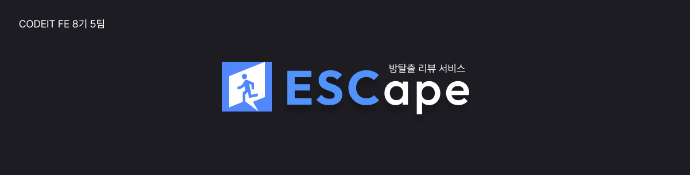

# 방탈출 리뷰 서비스 ESCape

> #### 🔗 배포 사이트 : https://es-cape-codeit.vercel.app/
> 테스트 계정(아이디/비밀번호) : 0855@test.com / 0855test!

<br>

## 👥 팀 소개

<table>
  <thead>
    <tr>
      <th style="width: 20%; text-align: center;"> <a href="https://github.com/ojm51">오정민</a> </th>
      <th style="width: 20%; text-align: center;"> <a href="https://github.com/kimsayhi">김세환</a> </th>
      <th style="width: 20%; text-align: center;"> <a href="https://github.com/KJongHwa">김종화</a> </th>
      <th style="width: 20%; text-align: center;"> <a href="https://github.com/naynara87">나윤주</a> </th>
      <th style="width: 20%; text-align: center;"> <a href="https://github.com/SealBros">서지훈</a> </th>
    </tr>
  </thead>
  <tbody>
    <tr>
      <td style="text-align: center;">  </td>
      <td style="text-align: center;"> 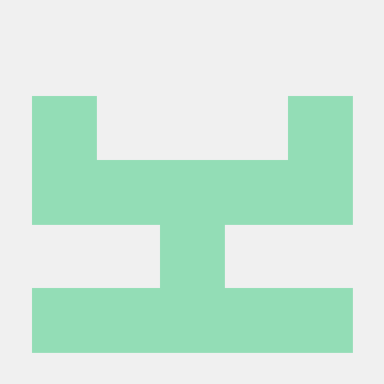 </td>
      <td style="text-align: center;">  </td>
      <td style="text-align: center;">  </td>
      <td style="text-align: center;"> 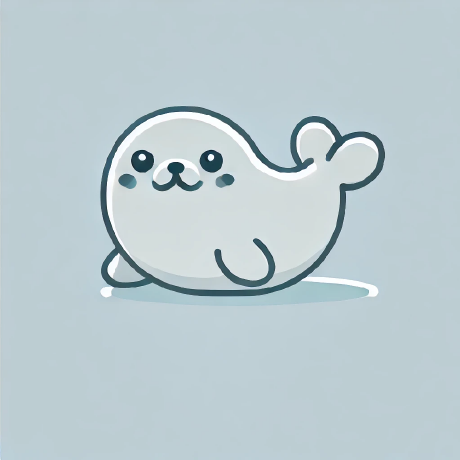 </td>
    </tr>
    <tr>
      <td style="text-align: center;">CSS / Tailwind 설정<br>데이터 수집<br> 마이 / 유저 페이지</td>
      <td style="text-align: center;">공용 컴포넌트 설계<br>데이터 수집 / 가공<br>상품 / 랜딩 페이지</td>
      <td style="text-align: center;">레포지토리 설정<br>데이터 수집<br>자유게시판 페이지</td>
      <td style="text-align: center;">유저 플로우 설계<br>데이터 수집<br>로고 디자인<br> 회원가입 / 로그인 페이지</td>
      <td style="text-align: center;">컨벤션 / 포매터 설정<br>데이터 수집 / 가공<br>상품 상세 페이지</td>
    </tr>
  </tbody>
</table>


<br>
<br>

## 🗓️ 프로젝트 기간
> **2024년 10월 07일(월) ~ 2024년 11월 11일(월)**

- **1주차:** 주제 선정 및 초기 세팅
- **2주차:** 1차 기능 개발
- **3주차:** 2차 기능 개발
- **4-6주차:** 통합 테스트 및 버그 수정, 발표 준비 및 기타 사항 보완
- **최종 주:** 발표 (11월 11일)

<br>
<br>

## 📐 설계


### ▪️ user Flow

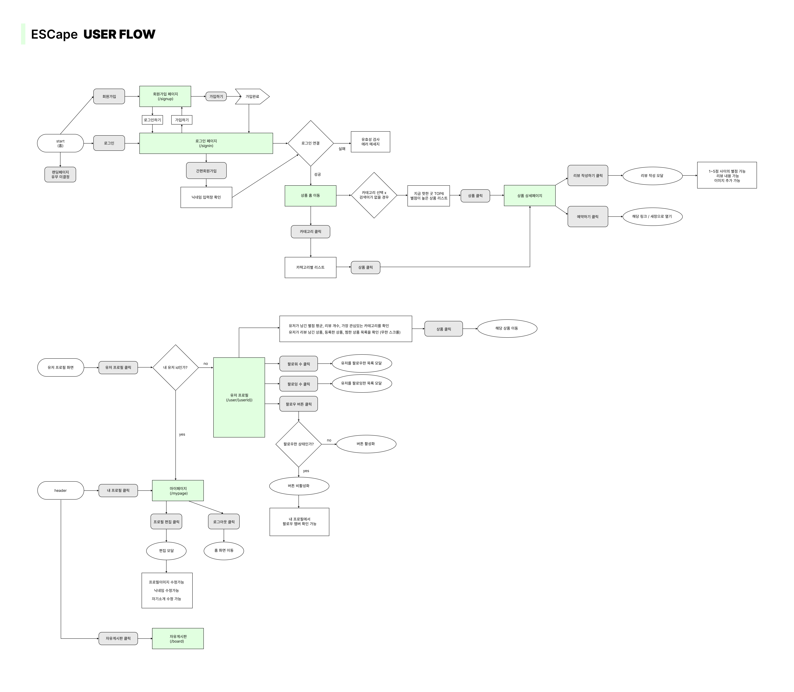

### ▪️ Directory

```
ESCape
├─ public
├─ src
│  ├─ components
│  │  ├─ @shared
│  │  ├─ addboard
│  │  ├─ auth
│  │  ├─ board
│  │  ├─ mypage
│  │  ├─ product
│  │  └─ productDetail
│  ├─ contexts
│  ├─ dtos
│  ├─ hooks
│  ├─ libs
│  │  ├─ axios
│  │  └─ constants
│  ├─ pages
│  │  ├─ addboard
│  │  ├─ board
│  │  ├─ error
│  │  ├─ mypage
│  │  ├─ oauth
│  │  ├─ product
│  │  ├─ signin
│  │  ├─ signup
│  │  └─ user
│  ├─ styles
└─ └─ utils
```

<br>

## ⚙️ 기술 스택

| 구분               | 기술 |
|--------------------|--------------------|
| **HTML**           |  |
| **CSS**            |  |
| **Package Manager** |  |
| **Front-End Tool** |   |
| **UI Library**     |  |
| **Git**            |  |
| **Deployment**     |   |

<br>

## 🖥️ 구현 페이지

<table>
  <thead>
    <tr>
      <th style="text-align: center;" width="150">구분</th>
      <th style="text-align: center;">구현 페이지</th>
    </tr>
  </thead>
  <tbody>
    <tr>
      <th style="text-align: center;">메인</th>
      <td style="text-align: center;">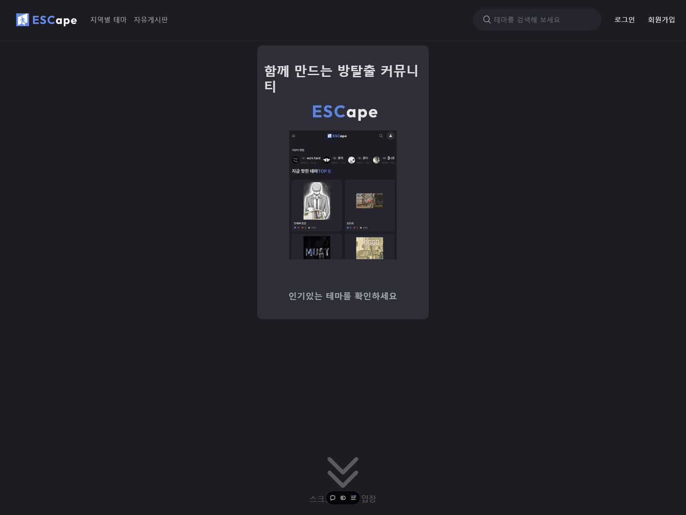</td>
    </tr>
    <tr>
      <th style="text-align: center;">로그인</th>
      <td style="text-align: center;"></td>
    </tr>
    <tr>
      <th style="text-align: center;">회원가입</th>
      <td style="text-align: center;"></td>
    </tr>
    <tr>
      <th style="text-align: center;">마이페이지</th>
      <td style="text-align: center;">
        
        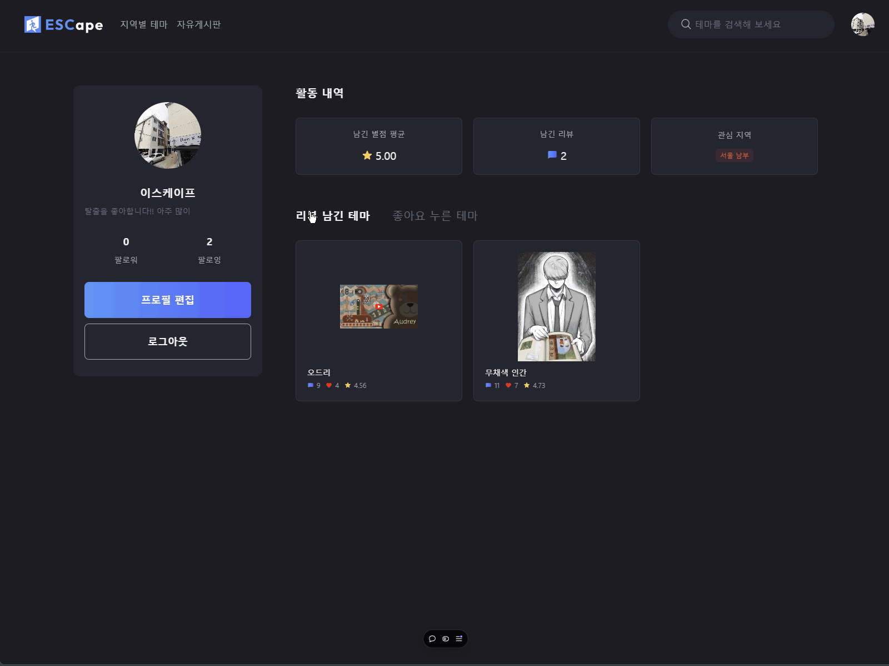
        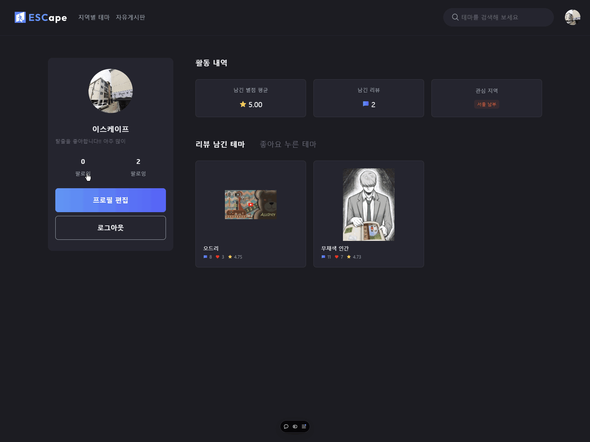
        
      </td>
    </tr>
    <tr>
      <th style="text-align: center;">자유게시판</th>
      <td style="text-align: center;">
        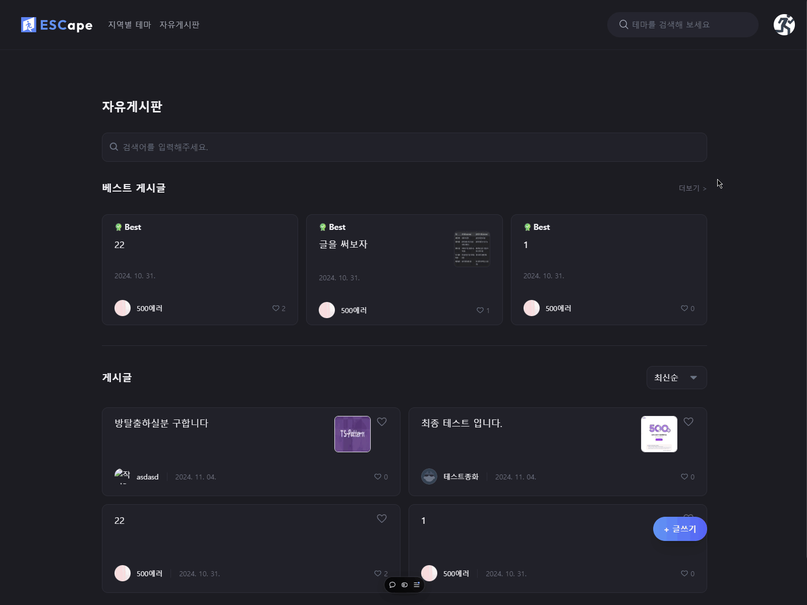
        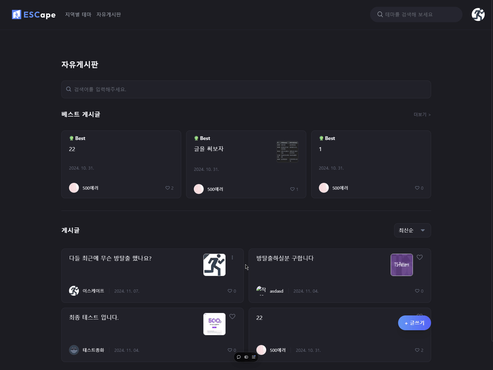
        
        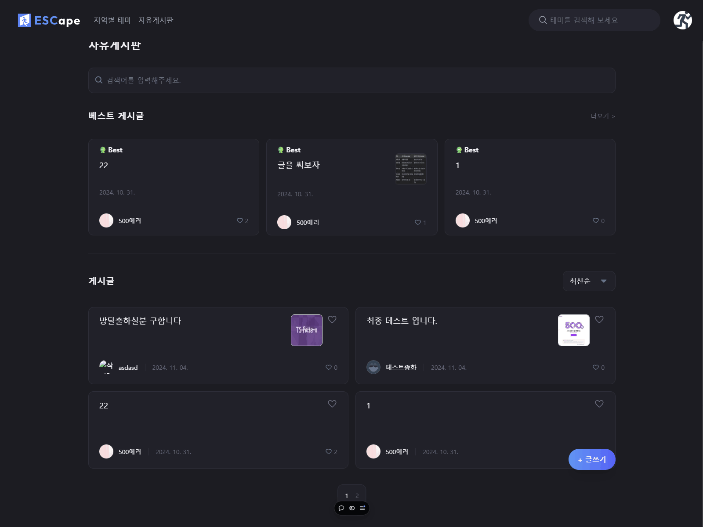
      </td>
    </tr>
    <tr>
      <th style="text-align: center;">자유게시판 글쓰기</th>
      <td style="text-align: center;"></td>
    </tr>
    <tr>
      <th style="text-align: center;">자유게시판 상세</th>
      <td style="text-align: center;">
        
        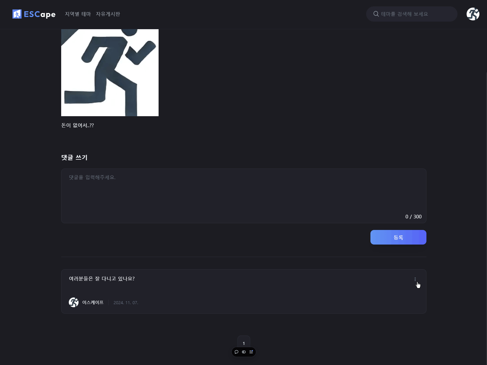
        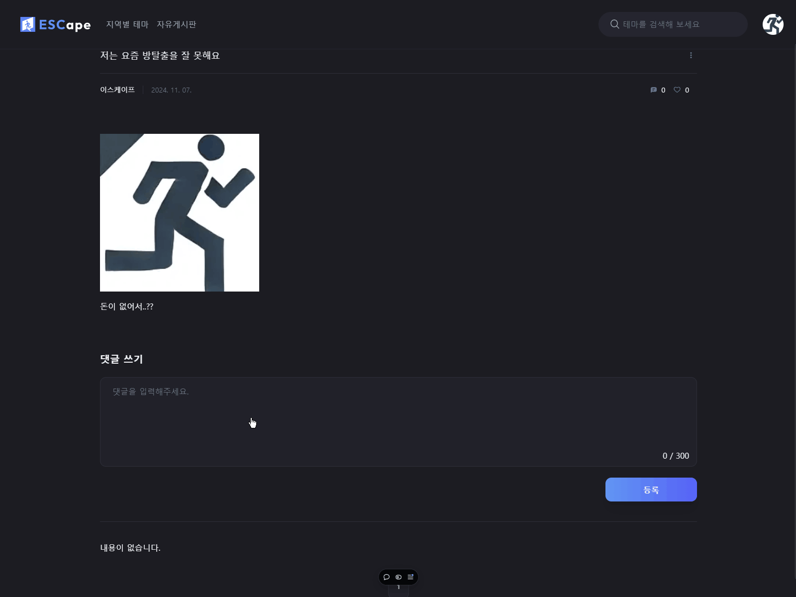
        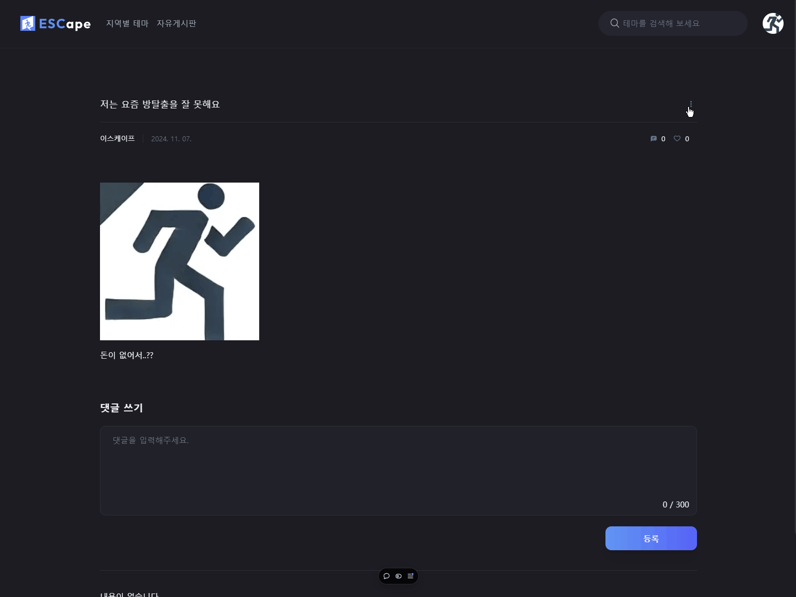
        
      </td>
    </tr>
    <tr>
      <th style="text-align: center;">지역별 테마</th>
      <td style="text-align: center;">
        
        
        
        
      </td>
    </tr>
    <tr>
      <th style="text-align: center;"><strong>타인 페이지</strong></th>
      <td style="text-align: center;">
        
        
        
      </td>
    </tr>
    <tr>
      <th style="text-align: center;"><strong>테마 상세페이지</strong></th>
      <td style="text-align: center;">
        
        
        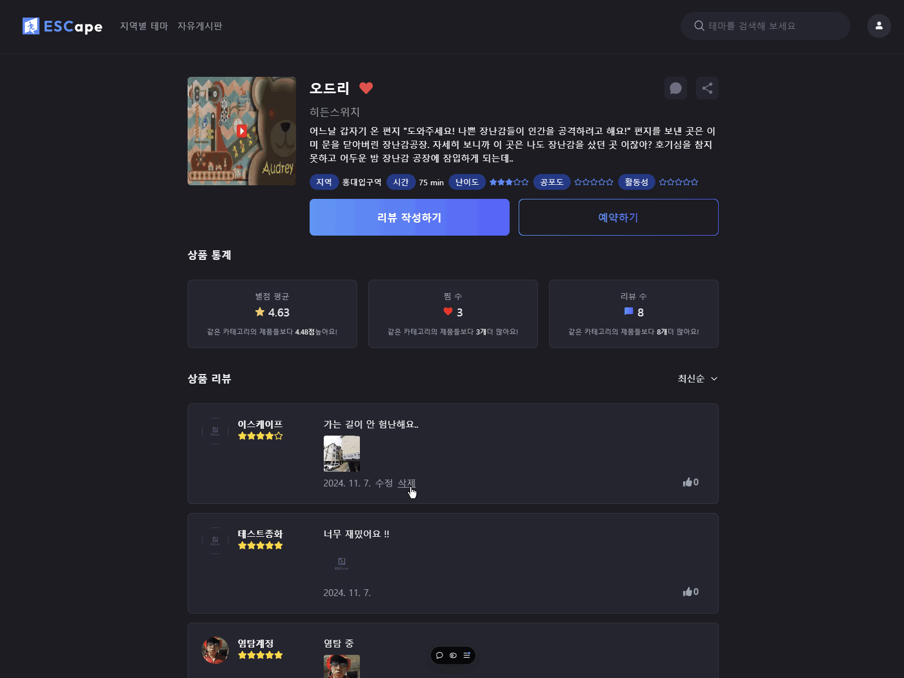
        
        
        
        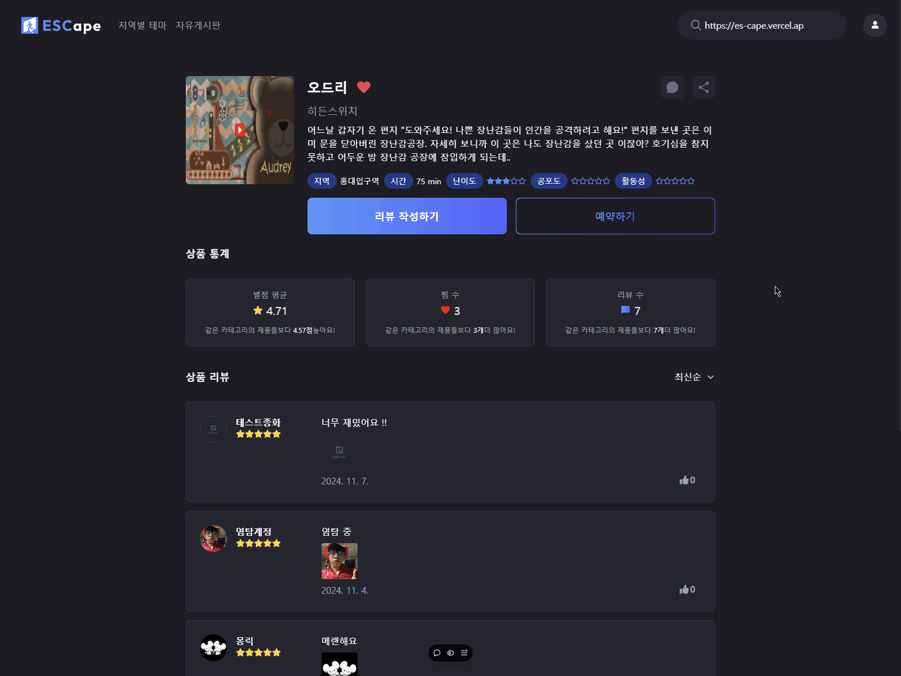
        
      </td>
    </tr>
  </tbody>
</table>

<br>

## 🎤 프로젝트 소감

<table style="width:100%">
  <thead>
    <tr>
      <th>좋았던 점</th> 
    </tr>
  </thead>
  <tbody>
    <tr>
      <td>“서로의 상황 및 컨디션을 배려하며 프로젝트를 진행함”</td></tr>   <tr>
      <td>“다른 팀원에게 막히는 부분이 있다면 나서서 도와주고 함께 고민함”</td></tr> 
        <tr><td>“서로를 존중하며 다양한 의견을 편하게 제시할 수 있는 분위기를 조성함”</td>
    </tr> 
  </tbody>
  </table>
<table style="width:100%">
  <thead>
    <tr>
    <th >아쉬운 점</th> 
    </tr>
  </thead>
  <tbody>
    <tr>
      <td>“다양한 아이디어를 제시했지만, 소통 오류로 반영되지 않은 경우가 있었음”</td></tr> 
        <tr><td>“오늘의 TodoList를 작성했지만, 예상치 못한 일이 생기거나 집중력이 떨어져 계획한 일을 끝내지 못한 경우가 많았음"</td> 
    </tr> 
  </tbody>
  </table> 
<table style="width:100%">
  <thead>
    <tr>
      <th >개선할 점</th> 
    </tr>
  </thead>
  <tbody>
    <tr>
      <td>“혼자 고민해보는 시간의 마지노선을 정하고, 그 시간이 지나도 해결이 안 될 때 질문하기 / 그 시간 동안만 혼자 고민하기”</td></tr> <tr>
      <td>“간단하게라도 매일 ‘자신이 하루동안 구현한 것 + 어려웠던 것 + 좋았던 것 + 소감’ 회고하고 기록 남기기”</td>
    </tr> 
  </tbody>
</table>
