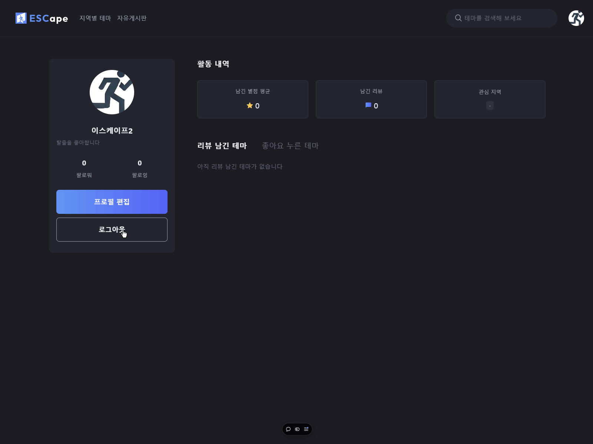

// prettier-ignore
# 

# 방탈출 리뷰 서비스 ESCape

> #### 🔗 배포 사이트 : https://es-cape-codeit.vercel.app/

<br>

## 👥 팀 소개

|               [오정민](https://github.com/ojm51)                |                     [김세환](https://github.com/kimsayhi)                     |                     [김종화](https://github.com/KJongHwa)                      |                   [나윤주](https://github.com/naynara87)                    | [서지훈](https://github.com/SealBros) |
| :--------------------------------------------------------------------------: | :--------------------------------------------------------------------------: | :--------------------------------------------------------------------------: | :-------------------------------------------------------------------------: | -------------------------------------- |
|  |  |  |  | |
|    CSS / Tailwind 설정,데이터 수집,마이 / 유저 페이지            |         공용 컴포넌트 설계,데이터 수집 / 가공, 상품 / 랜딩 페이지         | 레포지토리 설정,데이터 수집,자유게시판 페이지 | 유저플로우 설계,데이터 수집, 로고 디자인,회원가입 / 로그인 페이지 |   컨벤션 / 포매터 설정,데이터 수집 / 가공,상품 상세 페이지 |

<br>
<br>

## 🗓️ 프로젝트 기간

> **2024년 10월 07일(월) ~ 2024년 11월 11일(월)**
>
> > **🌱 1st week**
> >
> > - 10월 07일(월) ~ 10월 13일(일)
> >   - 주제 선정
> >   - 초기세팅
>
> > **☘️ 2nd week**
> >
> > - 10월 14일(월) ~ 10월 20일(일)
> >   - 1차 기능 개발
>
> > **🍀 3nd week**
> >
> > - 10월 21일(월) ~ 10월 27일(일)
> >   - 2차 기능 개발
>
> > **🍀 4nd - 6nd week**
> >
> > - 10월 28일(월) ~ 11월 10일(일)
> >   - 통합테스트 및 버그 수정
> >   - 발표 준비 및 기타 사항 보완
>
> > **🪴 final week**
> >
> > - 11월 11일(월)
> >   - 발표
>

<br>
<br>

## 📐 설계


### ▪️ user Flow


### ▪️ Directory

```
react-project-11
├─ public
├─ src
│  ├─ components
│  │  ├─ @shared
│  │  ├─ addboard
│  │  ├─ auth
│  │  ├─ board
│  │  ├─ mypage
│  │  ├─ product
│  │  └─ productDetail
│  ├─ contexts
│  ├─ dtos
│  ├─ hooks
│  ├─ libs
│  │  ├─ axios
│  │  └─ constants
│  ├─ pages
│  │  ├─ addboard
│  │  ├─ board
│  │  ├─ error
│  │  ├─ mypage
│  │  ├─ oauth
│  │  ├─ product
│  │  ├─ signin
│  │  ├─ signup
│  │  └─ user
│  ├─ styles
└─ └─ utils
```

<br>

## ⚙️ 기술 스택

|        구분           |                                                                                                                     기술                                                                                                                      |
| :-------------------: | :---------------------------------------------------------------------------------------------------------------------------------------------------------------------------------------------------------------------------------------------------------------: |
|       **HTML**        |    |
|        **CSS**        |    |
|  **Package Manager**  |                   |
|  **Front-End Tool**   |    |
|    **UI Library**     |                                                                                                                           |
|        **Git**        |   <br>          |
|       **Tools**       |   <br>            |
|    **Deployment**     |   |


<br>
<br>

## 🖥️ 구현 페이지 & 🧑‍💻 코드 리뷰

|               구분                |                                                          구현 페이지                                                          |                                                                                                                                                                                                                                                                                                                                                                                      구현 기능<br>(코드 리뷰)                                                                                                                                                                                                                                                                                                                                                                                      |
| :-------------------------------: | :---------------------------------------------------------------------------------------------------------------------------: | :------------------------------------------------------------------------------------------------------------------------------------------------------------------------------------------------------------------------------------------------------------------------------------------------------------------------------------------------------------------------------------------------------------------------------------------------------------------------------------------------------------------------------------------------------------------------------------------------------------------------------------------------------------------------------------------------------------------------------------------------------------------------------------------------: |
| **메인** |   |  |
| **로그인** |   |  |
| **회원가입** |  |  |
| **마이페이지**  |  | |
| **자유게시판** | | |
| **자유게시판 글쓰기** | | |
| **자유게시판 상세** | | |
| **지역별 테마** | | |
| **타인 페이지** | | |
| **테마 상세페이지** | | |


<br>
<br>

## 🎤 프로젝트 소감

|      좋았던 점                                                                                                                                                   |
| ------------------------------------------------------------------------------------------------------------------------------------------------------------- |
| “서로의 상황 및 컨디션을 배려하며 프로젝트를 진행함”                                                                                                            |
| “다른 팀원에게 막히는 부분이 있다면 나서서 도와주고 함께 고민함”                                                                                                |
| “서로를 존중하며 다양한 의견을 편하게 제시할 수 있는 분위기를 조성함”                                                                                            |

|      아쉬운 점                                                                                                                                                  |
| ------------------------------------------------------------------------------------------------------------------------------------------------------------- |
| “다양한 아이디어를 제시했지만, 소통 오류로 반영되지 않은 경우가 있었음”                                                                                           |
| “오늘의 TodoList를 작성했지만, 예상치 못한 일이 생기거나 집중력이 떨어져 계획한 일을 끝내지 못한 경우가 많았음"                                                 |

|      개선할 점                                                                                                                                                  |
| ------------------------------------------------------------------------------------------------------------------------------------------------------------- |
| “혼자 고민해보는 시간의 마지노선을 정하고, 그 시간이 지나도 해결이 안 될 때 질문하기 / 그 시간 동안만 혼자 고민하기”                                              |
| “간단하게라도 매일 ‘자신이 하루동안 구현한 것 + 어려웠던 것 + 좋았던 것 + 소감’ 회고하고 기록 남기기”                                                              |
